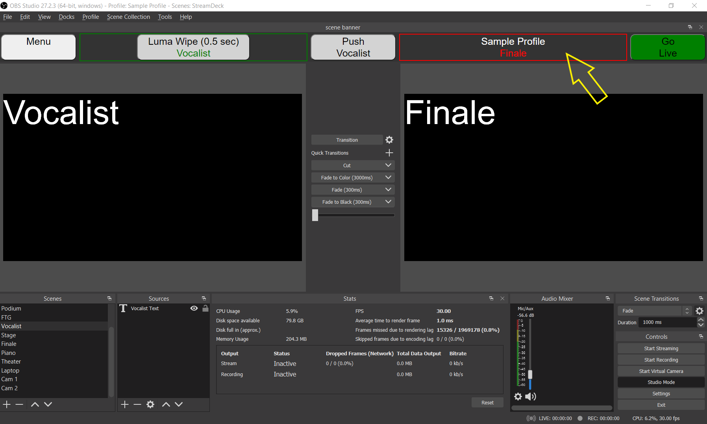

===============================
# OBS Scene Banner
===============================

## Purpose
OBS-Scene-Banner is a browser dock that prominently displays the Preview and Program scene names. Until such a much-requested feature is incorporated into the OBS base code, consider using this work-around. What's more, the dock also offers some useful buttons and/or a menubar that supplement the user interface.

## Requirements
------------
OBS-Scene-Banner is a javascript-intensive html page that interacts with OBS over the Websocket protocol, relying on a settings file for authentication credentials and other customizations.

Prerequisites:
- OBS 25.0.0 or later
- OBS Websockets 4.9.1 (note: 5.0 and later not supported)

Tested on Windows 10--not sure about other platforms.

## Installation
------------
1. Download and install the plugin: "obs-websocket - Remote-control OBS Studio from WebSockets"
 - https://github.com/obsproject/obs-websocket/releases/download/4.9.1/obs-websocket-4.9.1-Windows-Installer.exe

2. Download OBS-Scene-Banner and extract to a folder in your preferred OBS scripts directory.
- https://github.com/millerdq/OBS-Scene-Banner/releases/tag/v1.0

3. Edit OBS-Scene-Banner-Settings.js to establish the connection settings, making sure they comport with the Websockets Server settings found in the OBS Tools menu.

4. Add OBS-Scene-Banner.html as a Custom Browser Dock and postition full-width and height minimized, under the OBS menu bar.

5. Customize layout and optional features, following detailed instructions in the help file.
